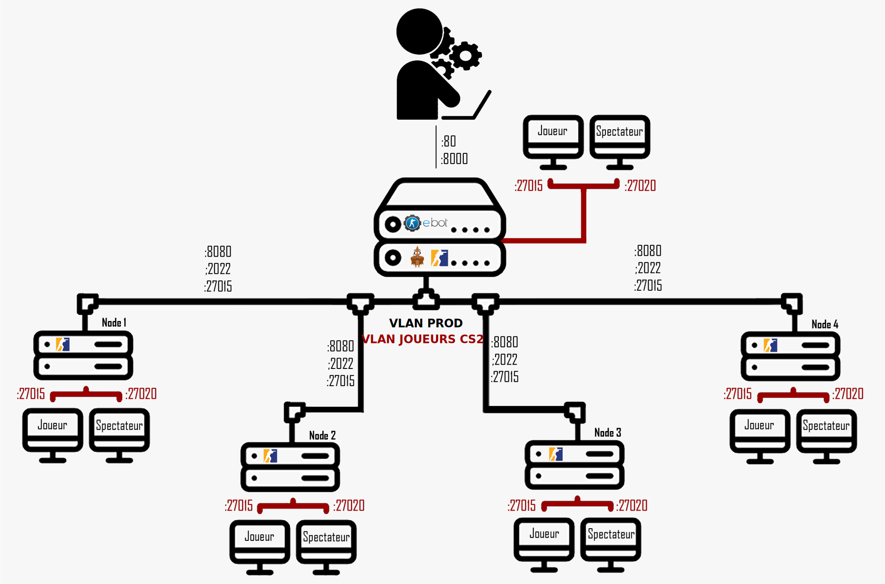

# Serveurs CS2 + eBot

## Contexte

Dans le cadre d'une compétition de jeux vidéo multigaming en physique, l'UTTArena, le déploiement et l'administration de serveurs et de matchs Counter Strike 2 est nécessaire.

## Fonctionnement

Pour créer des serveurs CS pour l'événement, nous allons utiliser deux outils différents :

- [Pterodactyl](https://pterodactyl.io/) : permet de créer et d'administrer les serveurs.
- [eBot](https://www.esport-tools.net/ebot/) : permet d'administrer les matchs et de les lancer.

Concrètement, nous aurons un serveur principal qui va héberger Pterodactyl et eBot, et des serveurs secondaires, appelés "Nodes", qui vont héberger les serveurs de jeu. Pour effectuer cette séparation, Pterodactyl utilise un système de "wings".

Une wing est un processus qui va gérer les serveurs de jeu. Elle communique avec le serveur principal pour récupérer les informations des serveurs à créer, puis elle crée et gère ces serveurs. Pour chaque PC de notre réseau, nous devrons installer une wing. 

Il est également possible d'installer une wing sur le serveur principal, mais il faudra cependant faire attention à la charge du serveur et ne pas le surcharger.



Voici un schéma de l'architecture en partant du principe qu'un Node héberge seulement un serveur CS2. Dans le cas où nous voulons plusieurs serveurs CS2 par Node, il suffit de faire un modulo 100 sur les ports.

### Exemple
- Serveur 1 : Joueurs : 27015    Spectateur : 27020
- Serveur 2 : Joueurs : 27115    Spectateur : 27120

Pour chaque serveur durant l'événement, nous configurons le VLAN pour permettre aux joueurs CS de se connecter aux serveurs.

## Prérequis

- Serveurs Linux (Debian 12.7) avec accès root.

### Ressources

- Pterodactyl : 
    - 4 Go de RAM
    - 2 vCPUs
    - 10 Go de stockage
- eBot :
    - 4 Go de RAM
    - 2 vCPUs
    - 10 Go de stockage
- Un serveur CS2 :
    - 4 Go de RAM
    - 4 vCPUs (> 3,5 GHz)
    - 50 Go de stockage

## Ce qui doit être modifié
Configuration des VLAN via le script [conf_VLAN.sh](./conf_VLAN.sh) qui sera executé lors de l'installation.

Une configuration des environnements est nécessaire. Pour cela, se référer aux dossiers [pterodactyl](./pterodactyl/) et [ebot](./ebot/).

## Installation
Pour réaliser l'installation, il faut dans un premier temps télécharger le dépôt :
```
sudo apt-get install -y curl unzip
curl -L -o cs2_server_ebot_LAN.zip https://github.com/Jeroneo/cs2_server_ebot_LAN/archive/refs/heads/main.zip
unzip cs2_server_ebot_LAN.zip
```

Modification de conf_VLAN.sh, sans oublier de configurer les environnements [pterodactyl](./pterodactyl/) et [ebot](./ebot/).
```
nano conf_VLAN.sh
```

Enfin, on lance l'installation avec la commande suivante, en tant que root :
```
su -
bash install_main.sh
```

## Installation d'une Wings

Pour installer une Wings, se fier à la documentation [disponible ici](./wings/).

## Utilisation

Vous pouvez acceder aux différents services via l'addresse IP local du VLAN PROD via :
- Pterodactyl : http://xxx.xxx.xxx.xxx:8000
- Ebot :  http://xxx.xxx.xxx.xxx
- Ebot admin : http://xxx.xxx.xxx.xxx/admin.php

